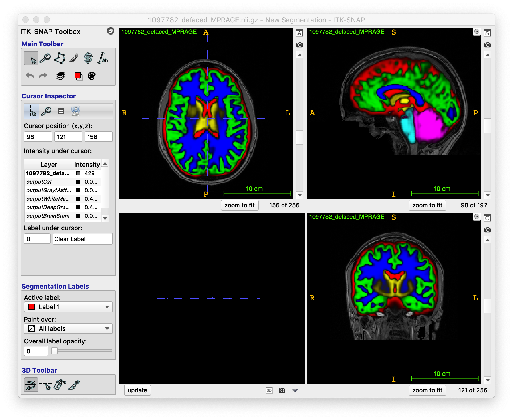

# App:  Brain Segmentation

Deep learning app made for T1-weighted MRI brain segmentation using ANTsRNet

## Model training notes

* Training data: IXI, NKI, Kirby, Oasis, ADNI SSTs
* Unet model (see ``Scripts/Training/``).
* Template-based data augmentation

## Sample prediction usage

```
#
#  Usage:
#    Rscript doBrainSegmentation.R inputImage inputImageBrainExtractionMask outputImage reorientationTemplate
#
#  MacBook Pro 2016 (no GPU)
#

$ Rscript Scripts/doBrainTissueSegmentation.R Data/Example/1097782_defaced_MPRAGE.nii.gz Data/Example/1097782_defaced_MPRAGEBrainExtractionMask.nii.gz output Data/Template/S_template3_resampled2.nii.gz

Reading reorientation template Data/Template/S_template3_resampled2.nii.gz  (elapsed time: 0.143312 seconds)
Using TensorFlow backend.
Loading weights filetrying URL 'https://ndownloader.figshare.com/files/13812053'
Content type 'application/octet-stream' length 5669488 bytes (5.4 MB)
==================================================
downloaded 5.4 MB

2018-12-12 16:09:29.346764: I tensorflow/core/platform/cpu_feature_guard.cc:140] Your CPU supports instructions that this TensorFlow binary was not compiled to use: AVX2 FMA
  (elapsed time: 7.987081 seconds)
Reading  Data//Example/1097782_defaced_MPRAGE.nii.gz  (elapsed time: 0.425921 seconds)
Normalizing to template and cropping to mask.  (elapsed time: 1.093345 seconds)
Prediction and decoding (elapsed time: 29.52414 seconds)
Renormalize to native space  (elapsed time: 3.744169 seconds)
Writing output  (elapsed time: 5.434884 seconds)

Total elapsed time: 40.53251 seconds
```

## Sample results


